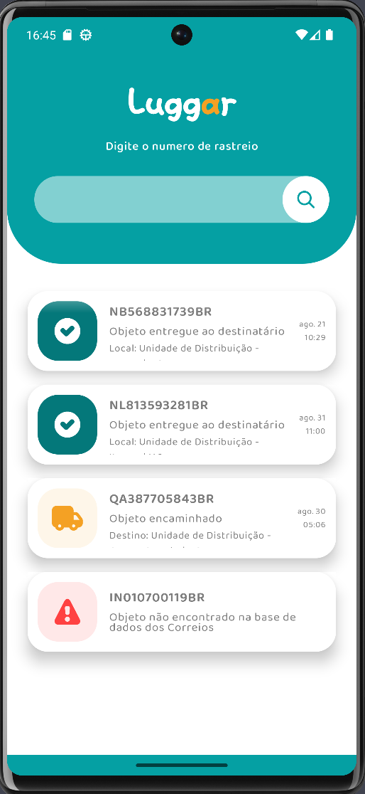
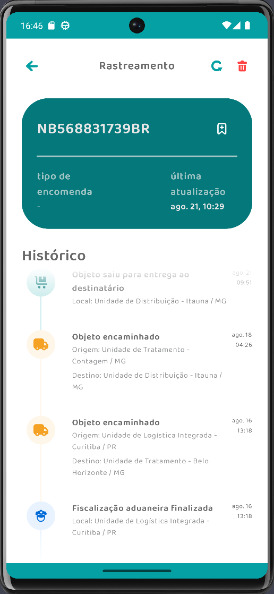

# Package Tracking App

Android package tracking app under development with Jetpack Compose, Tracking API, and Firebase.
Application code is on a private repository.

## Features

- Jetpack Compose UI. Custom animations, transitions, light/dark theme, and layouts.
- Jetpack Compose Navigation.
- Dependency injection with Hilt.
- Modularization (Feature based).
- CLEAN Archictecture.
- MVVM Architecture.
- SOLID principles.
- Retrieves tracking from the network.
- Notifications for tracking events.
- Light and Dark Themes.
- Tests (Unit, Integration, End 2 End).

## Libraries

- Jetpack Compose
- Firebase (Remote Config, Cloud Messaging)
- Retrofit
- OkHttp
- Moshi
- Hilt
- Room
- DataStore
- Navigation
- ViewModel
- Coil (Async Image Loader)
- Junit
- Google Thruth
- Turbine
- Hilt Testing

## Result

|  |  |
|---------------------------------------|:-----------------------------------:|
